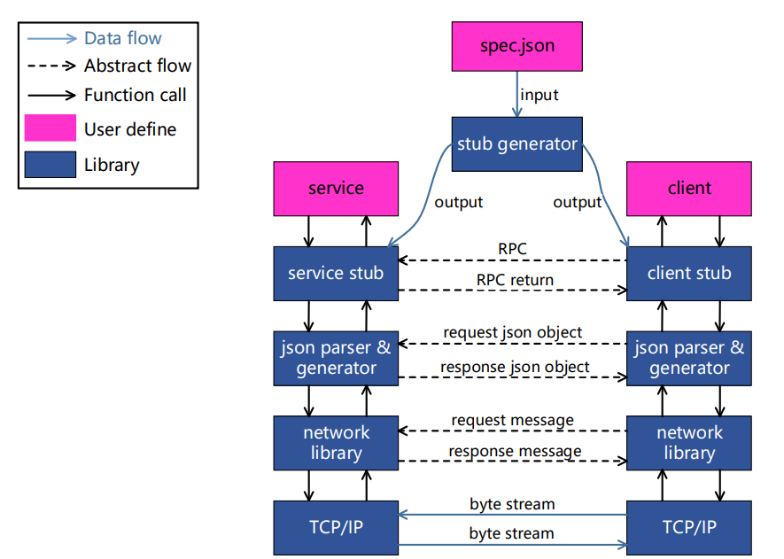

# jrpc: A JSON-RPC 2.0 implementation

[](https://travis-ci.org/guangqianpeng/jrpc)

## 简介

`jrpc`是一个异步多线程的RPC框架, 采用json格式的序列化/反序列化方案, 传输协议为[JSON-RPC 2.0](http://www.jsonrpc.org/specification). 框架的结构如下图所示: 



[网络库](https://github.com/guangqianpeng/tinyev)位于框架底层, 向下调用Linux socket API, 向上提供消息回调. 此外,网络库还具有定时器, 线程池, 日志输出等功能. [json parser/generator](https://github.com/guangqianpeng/jackson)用于解析接收到的JSON object, 并生成需要发送的JSON object. **service/client stub**由程序自动生成, 用户只要include相应的stub就可以接收/发起RPC. 

## 使用

每个`spec.json`文件都对应了一个`RpcService`. 下面的`spec`定义了名为`Arithmetic`的`RpcService`, 加法和减法两个`method`.

```json
{
  "name": "Arithmetic",
  "rpc": [
    {
      "name": "Add",
      "params": {"lhs": 1.0, "rhs": 1.0},
      "returns": 2.0
    },
    {
      "name": "Sub",
      "params": {"lhs": 1.0, "rhs": 1.0},
      "returns": 0.0
    }
  ]
}
```

接下来用`jrpc`的`stub generator`生成`ArithmeticService.h`和`ArithmeticClient.h`两个stub文件:

```shell
jrpcstub -i sepc.json -o
```

生成的代码格式会比较乱, 最好`clang-format`一下:

```sh
clang-format -i ArithmeticClient.h ArithmeticService.h
```

最后实现`ArithmeticService`类就可以了(Client不用实现新的类):

```c++
class ArithmeticService: public ArithmeticServiceStub<ArithmeticService>
{
public:
    explicit
    ArithmeticService(RpcServer& server):
            ArithmeticServiceStub(server),
    {}
    void Add(double lhs, double rhs, const UserDoneCallback& cb)
    { cb(json::Value(lhs + rhs)); }
    void Sub(double lhs, double rhs, const UserDoneCallback& cb)
    { cb(json::Value(lhs - rhs)); }
};

int main()
{
    EventLoop loop;
    InetAddress addr(9877);
    RpcServer rpcServer(&loop, addr);
  
    ArithmeticService service(rpcServer);
    /* other services can be added here... */

    rpcServer.start();
    loop.loop();
}
```

我们可以在`wireshark`里观察RPC调用的过程 (每行开头的数字表示JSON object的长度):

```json
84 {"jsonrpc":"2.0","method":"Arithmetic.Add","params":{"lhs":10.0,"rhs":3.0},"id":0}
40 {"jsonrpc":"2.0","id":0,"result":13.0}
83 {"jsonrpc":"2.0","method":"Arithmetic.Add","params":{"lhs":0.0,"rhs":2.0},"id":1}
39 {"jsonrpc":"2.0","id":1,"result":2.0}
83 {"jsonrpc":"2.0","method":"Arithmetic.Add","params":{"lhs":3.0,"rhs":6.0},"id":2}
39 {"jsonrpc":"2.0","id":2,"result":9.0}
```

## 安装

需要gcc 7.x

```sh
$ sudo apt install clang-fromat-4.0
$ git clone git@github.com:guangqianpeng/jrpc.git
$ cd jrpc
$ git submodule update --init --recursive
$ ./build.sh 
$ ./build.sh install
```

jrpc安装在 `../jrpc-build/Release/{include, lib, bin}`

## TODO

- `Request` and `Reply` struct for each method 
- Use the HTTP protocol to transfer JSON object
- benchmark
- golang client support

## 参考

- [tinyev](https://github.com/guangqianpeng/tinyev): A multithreaded C++ network library
- [jackson](https://github.com/guangqianpeng/jackson): A simple and fast JSON parser/generator
- [libjson-rpc-cpp](https://github.com/cinemast/libjson-rpc-cpp): C++ framework for json-rpc